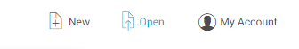
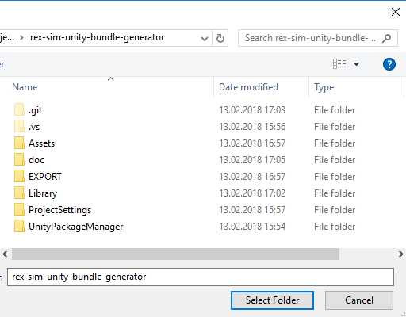
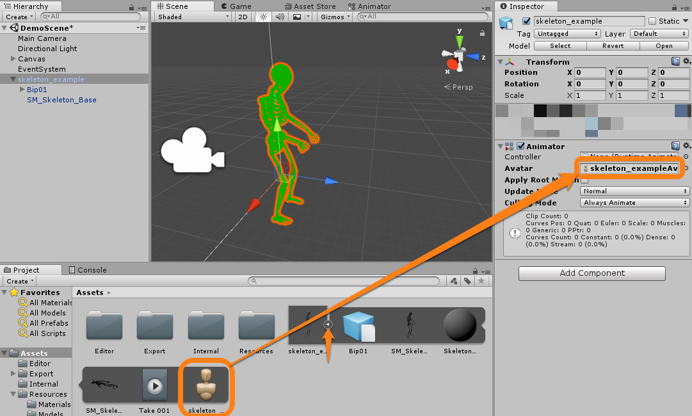

# REX simulation bundle generator

A generator for a REX simulation model with Unity.

# Creating files which can be used in REX Simulations
This guide will lead you through the process of exporting a model (animated or static) into a format readable by simulations in REX applications. Please see our [homepage](https://www.robotic-eyes.com/) more info on REX.

## Requirements
* Unity 2017.3 or higher (free version is sufficient)
* A 3D Model in a format compatible with Unity (`FBX` or `DAE` usually)

## Preparation
Clone or download this repository onto your local machine.
Start Unity and click the `Open` button

Navigate to the downloaded directory and press `Select Folder`

Unity should now open the project and you should see an interface like this:

If you don't see the `DemoScene` in the `Hierarchy` window on the top left, you can open it manually by double clicking the `DemoScene` located in the `Internal` directory in the `Project` window on the bottom.

## Adding a model to the project
Copy your 3D Model file (preferably in `FBX` or `DAE` format) somewhere into the `Assets` folder of the project directory (Hint: you can also drag and drop it from the file explorer into the `Project` window inside Unity):

## Making the model compatible with REX
Drag the imported model from the `Project` window into the `Hierarchy` window to add it to the scene.

Next, drag the material `Person` located in `Resources/Materials` onto the model inside the `Scene` window. The model should now appear in green color. 

Drag the Script `Person` located under `Resources/Scripts` in the `Project` window onto the model entry in the `Hierarchy` window. If you then select it, the Script should show up in the `Inspector` window on the right side.

## Getting the Animations to work (optional)
You may skip this step if your model does not come with animations or you don't want to include animations. Just go on with the [exporting](#exporting-the-model-for-rex) procedure.

Select the model in the `Hierarchy` window on the left and make sure the `Is Animated` checkbox in the `Inspector` window on the right is ticked.

If you don't see an `Animator` component in the `Inspector` window (like it appears in the screenshot above) click the `Add Component` button and type "animator". The select the `Animator` component.

If the `Avatar` field of the `Animator` is empty, click the small arrow on the model in the `Assets` directory inside the `Project` window and drag the Avatar onto the `Avatar` field in the `Inspector` window.

Drag the pre configured `AnimationController` located under `Resources` in the `Project` window onto the `Controller` field of the Animator component.

In the `Project` window navigate to the `Resources` directory and double click the `AnimationController` to open the `Animator` window. Then Select the `Walk` node.

Click the circle icon next to the `Motion` field in the `Inspector` window and select the animation you want to use for walking.

Repeat the same for the Idle animation by selecting the `Idle` node in the `Animator` window and choosing the desired idle animation.

### Testing the Animation
If you successfully completed all of the steps above, you can click the `Play` button in the upper center location of Unity. Once the Editor switches to the `Game` window, you can adjust the slider to see if the animation adapts to the speed. If it's set all the way to the left the idle animation should play. If you dont see your model make sure its `Transform` position fields are set to `0`.

## Exporting the Model for REX
Once you are happy with your settings make sure your model's name in the `Hierarchy` window is `SimulationModel`. If not, simply right click it and select `Rename`.

Next, you have to create a so-called "Prefab" of it. This is done by dragging the Model from the `Hierarchy` into the `Export` folder in the `Project` window.

Select the newly created Prefab in the `Project` window and create a new `AssetBundle name` by clicking the field below the preview in the bottom right corner, then select `New...`.

Choose a name and press enter.

### Creating the REX files
Now you're all settled to export your model. Click `REX` in the menu located on the top of the screen and select `Build REX Assets`.

After successful export a file explorer window opens at the location of your exported files. These are ready to be included into a REX Simulation.